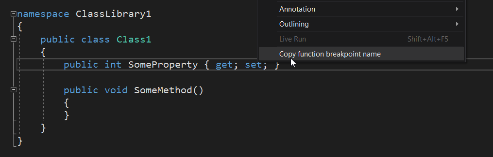
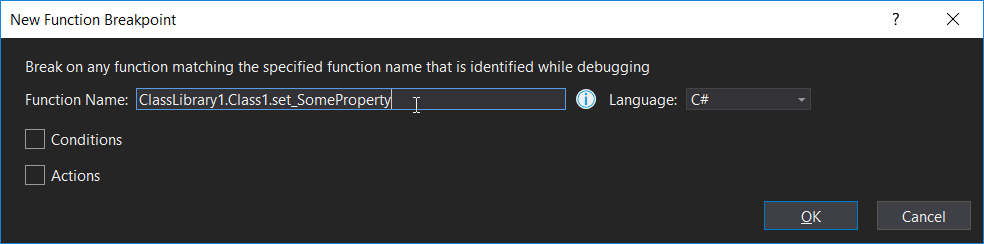
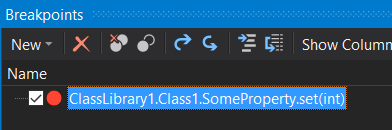

# Copy Function Breakpoint Name extension

This Visual Studio extension enables you to quickly copy a name to the clipboard which the New Function Breakpoint dialog understands.
This is useful when you cannot place a breakpoint directly in the current source view; for example, when viewing metadata or decompiled source, or when you’re in a separate instance of Visual Studio from the one in which you want to set the breakpoint.

Start by right-clicking the member inside which you want to break:

Then use <kbd>Ctrl</kbd>+<kbd>D</kbd>, <kbd>B</kbd> or your keyboard shortcut to open and focus the Breakpoints window:

And then <kbd>Ctrl</kbd>+<kbd>B</kbd> or your keyboard shortcut to open the New Function Breakpoint dialog:

Then <kbd>Ctrl</kbd>+<kbd>V</kbd> to paste and <kbd>Enter</kbd> to accept, and you’re done!

Currently requires Visual Studio 2017 Update 7 or later. The extension can be installed in Visual Studio 2019 but it has not been tested there.
